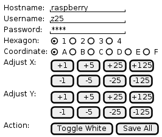

# OSC GUI

Requirements for OSC GUI to adjust or calibrate the hexagons that are being projected. The OSC interface is used in one direction, much like an IR remote control for a TV.

`Hostname`, `Username` and `Password` are always send when a button is being pressed.

When `Toggle White` is pressed, the projection will toggle between normal operation and showing only completely white hexagons without animation in order to help the adjusting (calibration).

When `Save` is pressed, the projection software will save the current coordinates of the hexagons which it has in its own memory to the XML which is used at startup.

`Hexagon` and `Coordinate` are send only when any of the adjust buttons is being pressed. What the adjust buttons do is pretty trivial.
